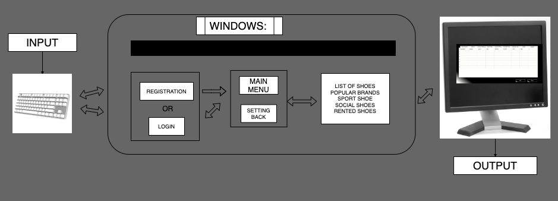
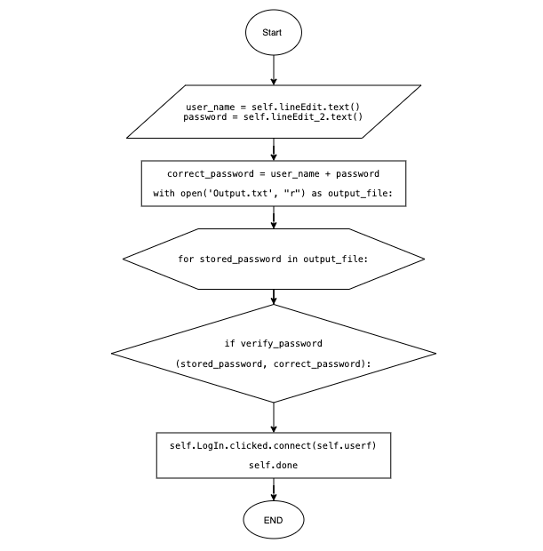
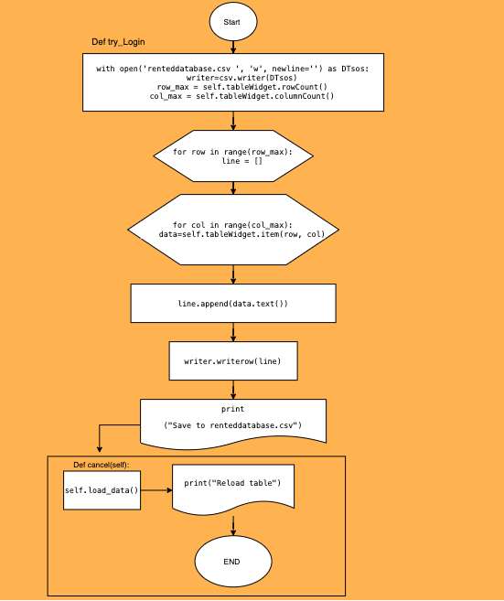

### Unit_3_Project_KelvenManuel_CS

 SHOE APP ( INVENTORY ) 
===========================


A SHOE Inventoy APP created using Python designed in QT design 


Contents
==============================================
  1. [Planning](#planning)
  1. [Design](#design)
  1. [Development](#development)
  1. [Evalution](#evaluation)
  

 1.Planning
==============================================

### Definition of the problem 
  In 2020. A business Man, called Irving fang, is running a shoe company. The company name is Shoe with fang and they are responsible for selling high level and Quality shoes. Mr. Irving has a significant number of shoes and does not know how to manage it. Besides, He presents a variety of brands with different shoe colorways, prices, and volatility. 

### Proposed Solution 
   Create an Application of software/App using the programming language ```PYTHON```, one of the top-picked programming languages of most universities and industries. The purpose of this application is to assist the user to manage their shoe supply. Where this App will meet the needs of the company, organizing the shoe in a set of criteria given by the user(Mr. Irving), such as brand, colorway, and quantity. Moreover, this app will allow the user to give the price of the shoe, edit their data and delete unnecessary or outdated information about shoes.  

### Success criteria

1. Create a Registration System; 
2. Create Login System; 
3. Identify the brand and the country that produced the Shoe;
4. Information about shoes supply of a specific shoe; 
5. Identify the colorway of every shoe; 
6. Recognize/provide the current price, past and retail price of every shoe;
7. Display the volatility of every shoe;
8. Organize the shoes in different categories; 
9. Every shoe can be edited and deleted;


# T.E.L.O.S 
feasibility study:

  A feasibility study, in general, is a tool for determining whether you have what it takes to undertake a change or new project. In business, most managers make use of a particular feasibility tool called TELOS, an acronym for the five key areas that you need to consider in your study(business.tutsplus.com):

T - Technical - Is the project technically possible?
E - Economic - Can the project be afforded? Will it increase profit?
L - Legal - Is the project legal?
O - Operational - How will the current operations support the change?
S - Scheduling - Can the project be done in time? 
(Wiki/TELOS)

The user will be no longer unable to manage its supply of shoes. The App will be created to help the user to manage his shoe inventory. Using Python and Qt design we will be able to create a program that will meet all the necessities of the user. That is, it will achieve all the items in the success criteria. The program will have a simple process of installation, without a large cust for the user. For the developer the cust for creating the program is manageable.  The developer is using one of the most used programming languages that present no illegal issues, and there will be no divergence between the new system and any regulations. 


 2.Design 
==============================================

### System Diagram of the App
The image below shoes the sytem diagram of the program where we put the input (Keyboard), the basic content of the Windows, and the output (Computer monitor). In the Monitor we are expected to see, and input data using the keyboard. 

### fig 01


### 1 Step drawing the windows - Basic draw of a user face ( sketch of the App )

These are basic drawings of the windows/user faces intended for the App. Having this, we can start creating the windows using the QT design. The platform was chosen by reasons that will be mentioned below ( in the Development). Also, working with Pycharm (python language) in the end we expect to have all the windows. Therefore, we will be able to connect and run them.  

### fig 02 


### 2 Step Convert into python programming language and run them 
 With Qt design, we designed user interfaces for the App. After that only left to convert the QT windows into python code then we will be able to run them and connect all of them. 
To convert QT Windows into python code we write in the terminal  ```.py pyuic5   (name of the window) -o (name of the window).py ```
 The images below show the windows created for the App, already running in python. Also, below the image, there is a stretch of the code that expresses the windows in python language.  

### fig 03

```.py
from PyQt5 import QtCore, QtGui, QtWidgets
from PyQt5.QtWidgets import QDialog

class userface1Form(object):
    def setupUi(self, userface1):
        userface1.setObjectName("userface1")
        userface1.resize(366, 441)
        userface1.setStyleSheet(
            "color: qlineargradient(spread:pad, x1:0, y1:0, x2:1, y2:0, stop:0 rgba(0, 0, 0, 255), stop:1 rgba(255, 255, 255, 255));\n"
            "background-color: qlineargradient(spread:pad, x1:0.615463, y1:0.642045, x2:0.8867, y2:0.846591, stop:0.142857 rgba(0, 0, 0, 255), stop:1 rgba(255, 255, 255, 255));")
```
# Flowcharts 
1. The flowchart below is a graphical representation of the process to code the try Login system, this aims to communicate how the process works or should work. A basic 

### fig 04

2. The flowchart below is another graphical representation of the process to code the Save system for one of the tables. The save code we Apply when we are making changes in the data inside the table in the iventory and we want to store them.

### fig 05

3.Development 
==============================================

### python
```PYTHON```is an interpreted, high-level, general-purpose programming language. Created by Guido van Rossum and first released in 1991, Python's design philosophy emphasizes code readability with its notable use of significant whitespace. Its language constructs and object-oriented approach aim to help programmers write clear, logical code for small and large-scale projects.( Python wikipedia )

### Why I decided to use python

Python is one of the most used/appreciated programming language by developers and software engineers. A big number of applications and webs that we enjoy today are because of Python. Python presents versability and flexibility. Besides, abundant libraries, a collection of modules, and extensions that allow developers to create efficient programs. Additionally, python can do complex tasks and possess a clean syntax and it is easy to learn. It is recommendable for Beginners and experienced programmers. It can connect to database systems, and also, read and modify files.

### Qt Design
Qt Designer is Qt's tool for designing and building graphical user interfaces (GUIs) from Qt components. You can compose and customize your widgets or dialogs in a what-you-see-is-what-you-get (WYSIWYG) manner, and test them using different styles and resolutions. (designer-manual.html)

The Qt design is the tool that will be used to design the user interface (windows) for the App. It will be used because is easy to manage,  and We can obtain a good result with it. Moreover, We can use it with python. Providing that python is our main language to develop the project QT Design is the right tool.

# Coding and Running the App in Python ( Pycharm )
--------------------------------------------------------------------

For the development of the App. And following the success criteria. I have broken down the problems into smaller steps or tasks. I had always the user preferences into account, so I drew the steps according to user wishes and  Necessities. Then I come out with 2 Sections for the Program tasks solutions

### Section A: 
----------------

Mostly draws and designs for the App ( Tool - QT design )
Convert the UI windows in Python Language 
This section was already complete and pieces of evidence are shown above in the Design ( Fig 01 & Fig 02 ) 

### Section B: 
-----------------

Mostly Coding and running the App 
Import windows and connect them ( button behavior ) 
Now I will address this section: 

1. Import the code of the UI Windows into a single python file.
This python file will be our main file for running the App. Therefore, we will be allowed to create classes and input there  only necessary elements that we will code.
```.py
# All the windows that we need to import to run the App completely.
from ShoeAppfinall.firstface import Ui_firstfaceForm as first
from ShoeAppfinall.Registration import Ui_RegistrationForm as reg                                                
from ShoeAppfinall.LogIn import Ui_loginForm as log
from ShoeAppfinall.loginRegistration import hash_password
from ShoeAppfinall.userface import Ui_userfaceForm as user
from ShoeAppfinall.Mainmenu import Ui_MainmenuForm as main
from ShoeAppfinall.App2 import ListofshoesA, PopularbrandsA, SportshoesA, SocialshoesA, RentedshoesA
```

2. Utilize windows as classes and connect them 
With the classes, we are showing only essential data to view. We are organizing the project into a practicable structure, going through the solution of the problems in small tasks. Additionally, using classes the structure of the program is described and gives a better understanding of the program.
```.py
# Class of the first Window that we can see in the App. 
class firstfaceApp(QMainWindow, first):
    def __init__(self, parent=None):
        super(firstfaceApp, self).__init__(parent)
        self.setupUi(self)
```

3. Button behavior used to Connect Windows 
This is a piece of the code and an example of how we connect the windows in the different classes. With this, we linked all windows and we can go through between them without programs.
```.py
     # Behavior for the registration button ( open the registration window )  
        self.registration.clicked.connect(self.regA)
     # Behavior for the login button ( open the Login window ) 
        self.login.clicked.connect(self.logAA)
     # Behavior for the exit button ( exit the App )
        self.exit.clicked.connect(self.exitApp)

 # The function that allows opening the registration window.  
    def regA(self):
        regVar = RegistrationApp(self)
        regVar.show()
```

4. Registration, security system ( Some parts of the code )
This code is responsible for the primer security system of the App, where to enter first the user should input the user_name, password, and confirmed the password. Also, this information will be stored but in a hash, so the security system is reliable. 
```.py
    def try_regist(self):
        if self.validate_registration():
            self.store()        
    def validate_registration(self):
        email = self.validate_email()
        password = self.validate_password()
        self.regist.clicked.connect(self.userf)
        return email and password
    def store(self):
        email = self.lineEdit.text()
        password = self.lineEdit_2.text()
        print("Hashing", email + password)
        msg = hash_password(email + password)
        with open('Output.txt', "a") as output_file:
            output_file.write('{}\n'.format(msg))
        self.close()
```
5. Try login ( Parts of the code ). 
The flowchart of the code is showed above in the Design(fig 04).
It guarantees the security of the Program where only allows the user to enter after input the correct user_name and password. 
```.py 
    def try_login(self):
        #self.LogIn.clicked.connect(self.userf)
        user_name = self.lineEdit.text()
        password = self.lineEdit_2.text()
        print("Hashing", user_name + password)
        correct_password = user_name + password
        with open('Output.txt', "r") as output_file:
            for stored_password in output_file:
                if verify_password(stored_password, correct_password):
                    self.LogIn.clicked.connect(self.userf)
```
6. Writing and Reading data inputted in the table.
```.py
    def load_data(self):
        data = []
        with open('database.csv') as listdatabase:
            file = csv.reader(listdatabase, delimiter=",")
            for a, row in enumerate(file):
                for b, col in enumerate(row):
                    data.append([a, b, col])
                    self.tableWidget.setItem(a, b, QTableWidgetItem(col))
        return data
```
7. Edit and Save information in the table 
These 2 codes below are an example of the codes that we use to edit and save data inputted by the user in the table. We created 5 tables with distinct functions every table is responsible for containing data about shoes in different sections such as rented shoes, and sports shoes.   
```.py
    def changeDB(self):
        item = self.tableWidget.currentItem()
        row = self.tableWidget.currentRow()
        col = self.tableWidget.currentColumn()
        self.tableWidget.item(row, col).setBackground(PyQt5.QtWidgets.QtGui.QColor(100, 100, 150))
        print(item.text())
        self.edit2.setDisabled(False)
        self.atras2.setDisabled(False)
```
The flowchart of the code is showed above in the Design(fig 05)
```.py
    def save(self):
        with open('populardatabase.csv', 'w', newline='') as DTpb:
            writer=csv.writer(DTpb)
            row_max = self.tableWidget.rowCount()
            col_max = self.tableWidget.columnCount()
            for row in range(row_max):
                line = []
                for col in range(col_max):
                    data=self.tableWidget.item(row, col)
                    if data is not None:
                        line.append(data.text())
                writer.writerow(line)
        print("Save to populardatabase.csv")
        
    def cancel(self):
        self.load_data()
        print("Reload table")
```

4.Evaluation 
==============================================


### What we can do to improve this program?

### References 

https://en.wikipedia.org/wiki/Python_(programming_language)

https://business.tutsplus.com/articles/can-we-really-do-it-how-to-conduct-a-telos-feasibility-study--cms-21442

https://en.wikipedia.org/wiki/TELOS_(project_management)

https://doc.qt.io/archives/qt-4.8/designer-manual.html

# Record of Tasks 
 
This table shows the 5 phases of the design: Planning, Design, Development, Test, and Implementation. 

| Task nº | Planned actions          |     Expected outcome            |   Time   |        Target Completion      | Criteria |
|---------|--------------------------|---------------------------------|----------|-------------------------------|----------|
|   1     | Planning:                | Acquire the first               | 15 min   | Did not come with clear       |     A    |
|         | Meet with the client for | requirements of the client      |          | questions, nor did the client |          |
|         | the first conversation   |                                 |          | have clear requirements       |          |
|   2     | Development: Create      | A phyton scrip that allows      |  1 hour  | Developed functions such as   |          |
|         | a secure login system    | encrypted login of a user       |          | "log in" & "register", using  |     A    |
|         | using phyton             |                                 |          | an encrypted password system. |          |
|         |                          |                                 |          | Need to further inquire as to |          | |         |                          |                                 |          | what "exit" entails           |          | 
|  3      | Planning:                | The success criteria for the    |  20 min  | Clear questions for the       |    A     |
|         | Meet with client for the | Iventory or Shoe App, details   |          | client, developer proposals   |          |
|         | 2nd conversation         | about the design & sytem of     |          | for the App                   |          | |         |                          | the App                         |          |                               |          | 
|  4      | Design:                  | A basic interface for the       | 30 min   | based on some examples create |    A     |
|         | Make a basic skecth draw | application, defining the basics|          | a sketch for the application  |          |
|         | of the interface for the | inputs, labels and buttons      |          | ask for feedback to the       |          |
|         | application              |  within the app                 |          | client                        |          |
|  5      | Planning:                | general feedback about the      |  25 min  | the skecth was already made as|    A     |
|         | Meet with client for the |first draw for the user interface|          | a draw. Present the sketh for |          |
|         | 3rd conversation         |client give arguments in the way |          | cleint view                   |          |
|         |                          |that developer can improve the   |          |                               |          |
|         |                          |the user interface               |          |                               |          |
| 6       | planning                 | general feedback about the      | 20 min   | come with all the codes and   | A        |
|         | meet with the client for | App so far, the user faces,     |          | user faces, small questions   |          |
|         | for the 4th meeting      | how it is organized and         |          | about user needs and          |          |
|         |                          | further comments/suggestion     |          | preferences                   |          |
| 7       | Design:                  | Review App windows(user         | 45 min   | Using QT design and Python    | B        |
|         | review all the user faces| face)App, see what could        |          | correct small mistakes and    |          |
|         | so far                   | be better and what could        |          | improve the codes/user faces  |          |
|         |                          | miss small or big changes       |          |                               |          |
| 8       | Development              | Connect all the windows         | 45 min   | Python coding, connect all    | C        |
|         | Connect all the windows  | by button behavior, see if      |          | the windows as classes        |          |
|         | in python charm          | it is possible to connect       |          | in pycharm                    |          |
|         |                          | all the windows                 |          |                               |          |
| 9       | Development              | A file where we can save        | 1:30h    | develop files for store data  | C        |
|         | Create a database file,  | all the data of the App         |          | and the login and             |          |
|         | Registration and Login   | in pycharm                      |          | registration using Hash codes |          |
|         | system                   | Registration and the Login      |          |                               |          |
|         |                          | system of the App               |          |                               |          |
| 10      | Development              |                                 | 45 min   | come with a basic code        | C        |
|         | Write the code a code    | The user will be able to        |          | that will be used as model    |          |
|         | that allow the user to   | edit the table                  |          | make the correct changes in   |          |
|         | input change, to delete, | input new shoes or delete       |          | the code and run it with      |          |
|         | to edit the tables       | them, Edit data and save it     |          | the App                       |          |
|         | in the inventory         |                                 |          |                               |          |
| 11      | Design                   | The System diagram of the       | 1 hour   | Come with a basic idea of     | B        |
|         | Draw the system diagram &| APP and 3 flow charts of        |          | the intended system diagram   |          |
|         | flow charts of the codes | codes used in the App           |          | and draw 3 flow charts of 3   |          |
|         |                          |                                 |          | main codes inside the App     |          |
| 12      | Evaluation               | Proof that All the success      | 1 hour   | Create a basic outline for    | D        |
|         | Make a video recording of| criteria points where           |          | the video following it        |          |
|         | the application working  | achieved                        |          | and cover all the points      |          |
|         |                          |                                 |          | in the success criteria       |          |
